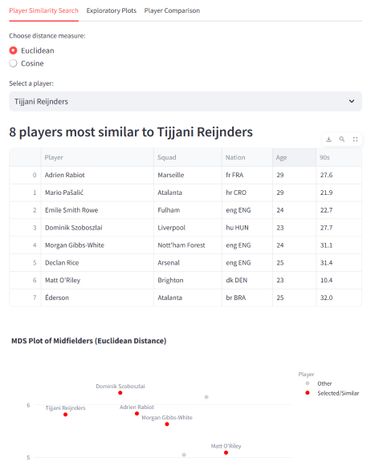
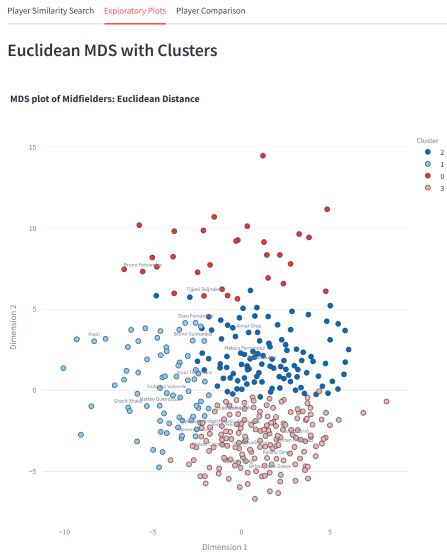
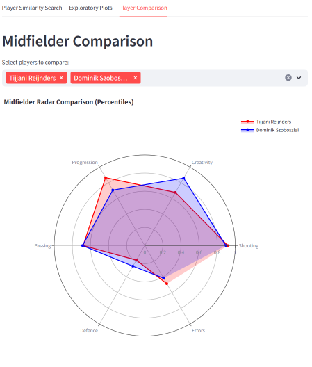
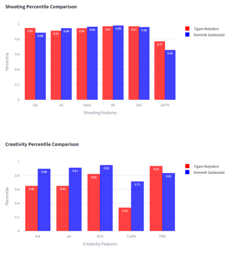

# Midfielder Similarity Explorer

A data-driven project to analyse and visualise midfielder performance in Europe’s top football leagues. This project combines statistical analysis, dimensionality reduction, clustering, and an interactive Streamlit app to explore player similarities and playing styles.
Interactive app link: [Midfielder Similarity App](https://midfielder-similarity.streamlit.app/)

## Project Overview

This project aims to:

* Collect and merge detailed midfielder statistics from multiple sources (fbref tables).
* Explore relationships between metrics and reduce dimensionality using PCA.
* Compute player similarity using distances derived from PCA projections.
* Visualise player similarities with Multidimensional Scaling (MDS) and highlight clusters using K-means.
* Provide an interactive interface through a Streamlit app to search for similar players, view clusters, and compare percentile metrics.

## Data

* Raw data is sourced from [fbref](https://fbref.com/) tables for midfielders in top European leagues.
* The processed dataset (`mids_selected.csv`) contains cleaned, normalised per-90 statistics for each player, ready for analysis and use in the Streamlit app.

## Analysis

* **Correlation Analysis:** Explore relationships between features to identify redundancies and patterns.
* **PCA (Principal Component Analysis):** Reduce dimensionality and identify the main axes of variation.
* **MDS (Multidimensional Scaling):** Project players into 2D space based on Euclidean and cosine distances from PCA projections.
* **K-Means Clustering:** Group players into 4 clusters representing distinct midfielder archetypes.

## Streamlit App

The interactive app allows users to:

* Select a player and see the 8 most similar midfielders.
* Toggle between Euclidean and cosine distances to explore different similarity perspectives.
* Visualise players on MDS plots colored by cluster.
* Compare players using radar charts and percentile metrics across shooting, passing, progression, creativity, defending, and errors.

To run the app:

```bash
streamlit run mids_app.py
```

## Streamlit App Preview

### Player Similarity Search


### Exploratoratory Plots


### Radar


### Percentile Comparison


## Key Insights

* PCA and correlation analysis reveal patterns and redundancies in midfielder statistics.
* Euclidean MDS highlights players with similar raw output; cosine MDS highlights players performing similar roles with differing efficiency.
* K-means clusters correspond to intuitive midfielder archetypes such as playmakers, progressive carriers, and defensive midfielders.
* The Streamlit app provides a practical interface to explore these relationships interactively.
